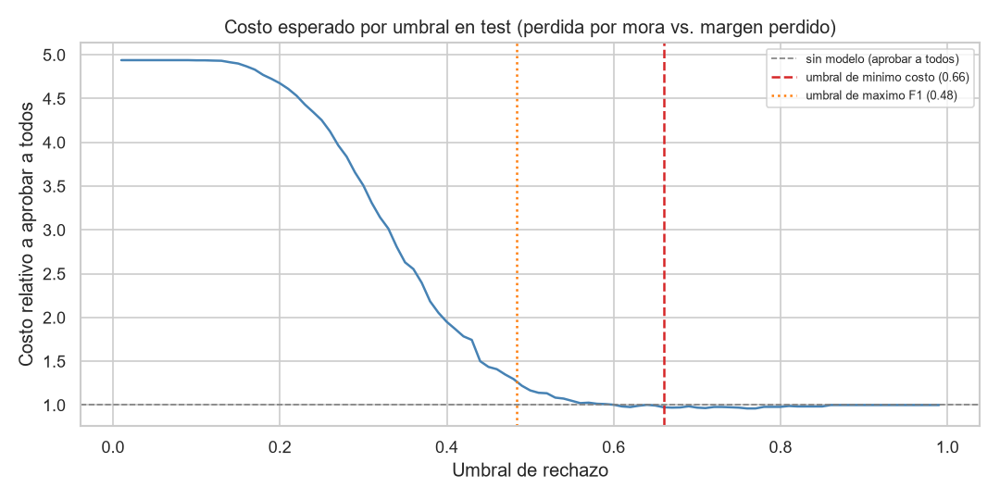
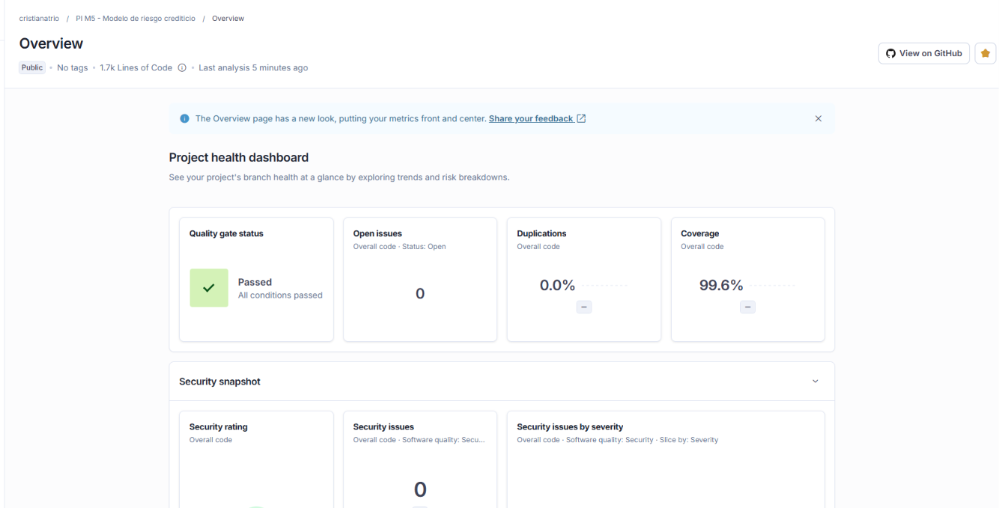
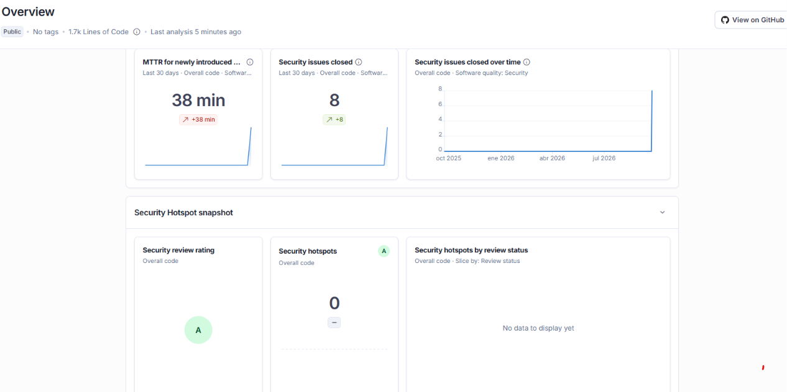
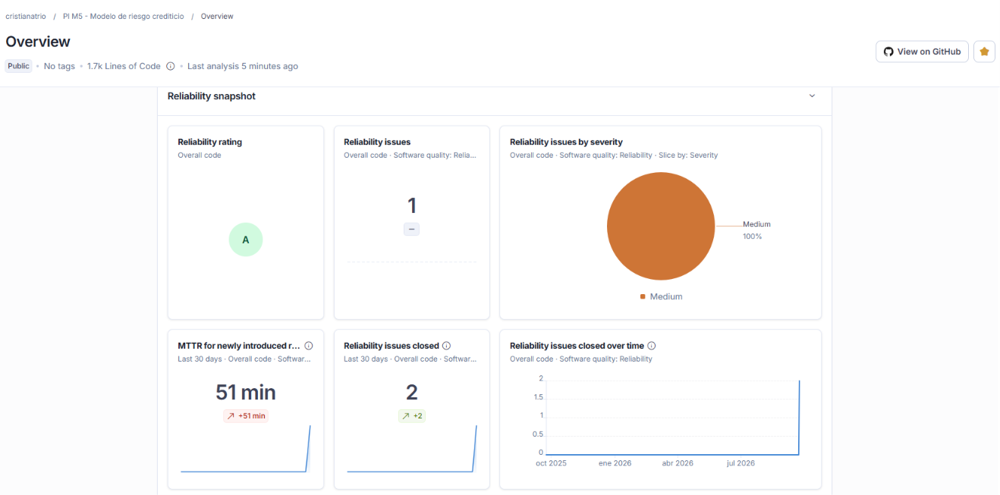
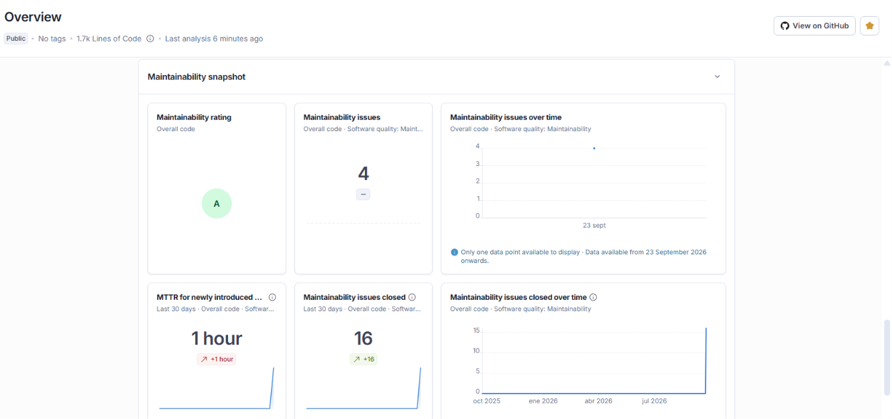

# PI M5 - Modelo predictivo de riesgo crediticio

[](https://sonarcloud.io/summary/new_code?id=cristianatrio_pi-m5-riesgo-crediticio-CristianAtrio) [](https://sonarcloud.io/summary/new_code?id=cristianatrio_pi-m5-riesgo-crediticio-CristianAtrio) [](https://sonarcloud.io/summary/new_code?id=cristianatrio_pi-m5-riesgo-crediticio-CristianAtrio) [](https://sonarcloud.io/summary/new_code?id=cristianatrio_pi-m5-riesgo-crediticio-CristianAtrio) [](https://sonarcloud.io/summary/new_code?id=cristianatrio_pi-m5-riesgo-crediticio-CristianAtrio) [](https://sonarcloud.io/summary/new_code?id=cristianatrio_pi-m5-riesgo-crediticio-CristianAtrio)

Proyecto Integrador del Modulo 5 (Data Science, Henry). Modelo de machine learning
que anticipa si un nuevo solicitante de credito pagara a tiempo, desplegado como API
(FastAPI + Docker) con monitoreo de data drift y una app Streamlit.

## Caso de negocio

Una financiera otorga creditos de consumo de corto plazo (mediana 1,9 M a 10 meses). El 4,75% de los
creditos no se paga a tiempo y cada mora cuesta capital, cobranza y provisiones. Hoy la decision se apoya en
el score de la central de riesgo y en reglas manuales. El objetivo es un modelo que, con los datos disponibles
**en el momento de la solicitud** (solicitante, producto e historial en la central), estime la probabilidad de
mora de cada nuevo cliente para priorizar analisis, ajustar montos o rechazar.

Restricciones: estructura de carpetas fija (pipelines de Jenkins), flujo de ramas `developer -> certification ->
master` con PR aprobado por un par, y todo reproducible desde el repo.

Resultado: Random Forest con ROC-AUC 0,69 en test y **0,72 out-of-time** (creditos posteriores al
entrenamiento), Gini 0,39 y KS 0,33. El modelo ordena bien el riesgo, pero el hallazgo de negocio clave es otro:
con los supuestos de costos (una mora aprobada pierde el 60% del capital y un buen cliente rechazado, el 15% de
margen), **rechazar en automatico con el umbral de F1 costaria ~30% mas que aprobar a todos**. El umbral de minimo
costo (0,66) rechaza solo el 1% de las solicitudes y ahorra un 2,6%; el valor real del modelo esta en priorizar la
**revision manual** (banda "revisar"), no en el rechazo automatico. Las variables que mas pesan son el score de la
central, las consultas recientes, la edad, los ingresos estimados y el plazo. Un score interno (`puntaje`) fue
descartado por contener el resultado.

> Estado actual: **V1.5.0** - los 4 avances + extra credit (SonarCloud: quality gate passed) + mejoras de la
> auditoria: exclusion de creditos censurados, validacion out-of-time, umbral por costo de negocio con KS / Gini, y
> API protegida con API key. 76 pruebas automatizadas. Modelo en produccion: **Random Forest**.

## Estructura del repositorio (no modificar: los pipelines de Jenkins dependen de ella)

```
mlops_pipeline/
├── src/
│   ├── Cargar_datos.ipynb
│   ├── comprension_eda.ipynb
│   ├── ft_engineering.py
│   ├── model_training_evaluation.py
│   ├── model_deploy.py        # API FastAPI: /health, /model/info, /predict, /predict/batch
│   ├── model_monitoring.py    # data drift: PSI, KS, chi-cuadrado, drift de prediccion
│   ├── app_streamlit.py       # app de prediccion, explicacion, lote y monitoreo
│   └── config.json            # parametros: target, exclusiones, rangos, seed, censura, validacion temporal, costos, drift
├── models/                    # modelo_riesgo.joblib (preprocesador + modelo), feature_names.json
├── reports/                   # metrics.json, comparacion_modelos.csv, importancia_variables.csv
│   ├── figures/               # curvas ROC/PR, matrices de confusion, comparacion, importancias, costo por umbral
│   ├── sonarcloud/            # capturas de los resultados de SonarCloud
│   └── drift/                 # reportes de drift (json, md, csv) y figuras PSI por escenario
└── data/                      # splits transformados (parquet, ignorados por git)
.github/workflows/ci.yml       # CI: compila, feature engineering, monitoreo, pytest, build y prueba de la imagen Docker
tests/                         # 76 pruebas pytest: API, feature engineering, entrenamiento, monitoreo y app Streamlit
sonar-project.properties       # configuracion de SonarCloud (extra credit)
pyproject.toml                 # configuracion de ruff, pytest, coverage y bandit
Dockerfile                     # imagen de la API (python:3.12-slim, usuario no root, healthcheck)
Dockerfile.app                 # imagen de la app Streamlit (opcional)
docker-compose.yml             # api + app como dos servicios
.dockerignore / Dockerfile.app.dockerignore
requirements-api.txt           # dependencias minimas de la imagen de la API
requirements-app.txt           # dependencias minimas de la imagen de la app
Base_de_datos.csv
requirements.txt               # dependencias completas de desarrollo y CI
requirements*.lock             # versiones exactas + hashes de todas las dependencias (CI y Docker instalan desde aca)
set_up.bat                     # crea el venv, instala requirements y registra el kernel
.gitignore
readme.md
```

## Ramas y versionado

| Rama | Rol |
|---|---|
| `developer` | Todo el desarrollo nuevo sale de aca |
| `certification` | Validacion antes de produccion (PR desde `developer`, aprobado por un par) |
| `master` | Produccion (PR desde `certification`) |

| Version | Contenido |
|---|---|
| V1.0.0 | Estructura de carpetas identica en las 3 ramas |
| V1.0.1 | `Cargar_datos.ipynb` y `comprension_eda.ipynb` |
| V1.0.2 | Correcciones del review del EDA (rango completo de `puntaje_datacredito`, etiquetas y conteos) |
| V1.1.0 | Ingenieria de caracteristicas + entrenamiento, evaluacion y seleccion de modelos |
| V1.2.0 | Monitoreo de data drift, app Streamlit, CI con GitHub Actions |
| V1.3.0 | API FastAPI, Dockerfile, pruebas con pytest, CI con build de la imagen |
| V1.3.1 | App Streamlit en Docker y `docker-compose` con API + app |
| V1.4.0 | Extra credit: SonarCloud, pruebas de todos los modulos (cobertura 99%), ruff y bandit en el CI |
| V1.4.1 | Fix de seguridad de SonarCloud: lock files con hashes, instalacion solo desde wheels, action fijada por SHA |
| V1.4.2 | Fix de mantenibilidad de SonarCloud: asserts separados, hiperparametros explicitos, nombres de variables |
| V1.5.0 | Mejoras de la auditoria: censura del target, validacion out-of-time, umbral por costo de negocio (KS, Gini, ahorro) y API key en la API |

## Setup local

```bat
set_up.bat
```

o manualmente:

```bash
py -3.12 -m venv pim5_riesgo_crediticio-venv
pim5_riesgo_crediticio-venv\Scripts\activate
pip install -r requirements.txt
```

`requirements.txt` fija versiones exactas (Python 3.12). Si se actualiza una dependencia, correr los dos scripts del
Avance 2 y verificar que `mlops_pipeline/reports/metrics.json` no cambie.

## Avance 1 - EDA (resumen)

- 10.763 creditos, 23 variables, target `Pago_atiempo` (1 = pago a tiempo). Se modela **mora = 1 - Pago_atiempo**.
- **Desbalance fuerte**: 4,75% de mora (511 casos). El accuracy no sirve; se evalua con ROC-AUC, PR-AUC, recall y F1 de la clase mora.
- **`puntaje` es fuga de informacion**: separa perfectamente las clases (todo moroso <= 62,7; todo cumplidor >= 63,8). Excluida.
- Senales legitimas: `puntaje_datacredito` (-), `huella_consulta` (+), `edad_cliente` (-), `plazo_meses` largo (+), ingresos estimados por la central (-), tendencia de ingresos decreciente (+), ausencia de dato en la central (+).
- Calidad: edades 121-123, salarios de miles de millones, `tendencia_ingresos` con numeros, `puntaje_datacredito` fuera de 150-950. Decisiones en `comprension_eda.ipynb`, seccion 5.

## Avance 2 - Ingenieria de caracteristicas y modelado

### `ft_engineering.py` (pipeline sklearn + feature-engine)

| Paso | Tecnica | Variables |
|---|---|---|
| Limpieza (`LimpiezaCredito`) | Valores imposibles -> nulo; drop `puntaje` y `fecha_prestamo` | edad >= 100, salario 0, score fuera de 150-950, tendencia no valida |
| Indicadores de faltante | `AddMissingIndicator` | promedio_ingresos_datacredito, saldo_mora, saldo_principal, saldo_mora_codeudor |
| Imputacion saldos | `ArbitraryNumberImputer(0)` (sin deuda reportada) | saldo_* |
| Imputacion numericas | `MeanMedianImputer(median)` (robusta a outliers) | edad, salario, puntaje_datacredito, promedio_ingresos |
| Imputacion categorica | `CategoricalImputer("Sin dato")` (el nulo es informativo) | tendencia_ingresos |
| Outliers | `Winsorizer(p99, cola derecha)` | montos y saldos |
| Features nuevas (`FeaturesCredito`) | ratios y flags de negocio | ratio_cuota_salario, ratio_deuda_salario, ratio_capital_salario, plazo_largo, tiene_mora_previa, sin_historial_financiero, creditos_total_sectores |
| Asimetria | `LogCpTransformer(log(x+1))` | montos, saldos y ratios |
| Categorias raras | `RareLabelEncoder(tol=0.3%)` | tipo_credito (6, 7, 68 -> Rare) |
| Encoding | `OneHotEncoder` | tipo_credito, tipo_laboral, tendencia_ingresos |
| Multicolinealidad | `DropCorrelatedFeatures(0.9)` | descarta 6 redundantes (saldo_total, creditos_total_sectores, dummies complementarias, etc.) |
| Escalado | `StandardScaler` | todas (necesario para la regresion logistica) |

Salida: 32 features. El preprocesador viaja dentro del pipeline del modelo (unico artefacto de inferencia:
`modelo_riesgo.joblib`), asi la API recibe datos crudos y no hay dos versiones que puedan divergir.
`LimpiezaCredito` valida el esquema de entrada (`COLUMNAS_REQUERIDAS`) y falla con un mensaje operativo si falta una columna.

```bash
python mlops_pipeline/src/ft_engineering.py
```

### `model_training_evaluation.py`

- **Censura del target**: se excluyen los creditos que todavia no pudieron caer en mora. Entra un credito si ya
  vencio o si lleva al menos 6 meses desde el desembolso (`config.json` -> `censura`). Quedan fuera 591 de 10.763
  (5,5%); incluirlos como "pago a tiempo" metia ruido en el target (EDA 3.6).
- Split estratificado 80/20 (`random_state=42`), `StratifiedKFold(5)`, un solo ajuste por fold.
- **Validacion out-of-time (OOT)**: cada modelo se reentrena con el 80% mas antiguo y se evalua con el 20% mas
  reciente (creditos desde 2025-06-20). Es la estimacion mas cercana al uso real: entrenar con el pasado y decidir sobre
  el futuro.
- El preprocesador se ajusta dentro de cada fold (`Pipeline(preprocesador, modelo)`): sin fuga de imputaciones.
- **Umbral por costo de negocio**: con las probabilidades out-of-fold del train se elige el umbral que minimiza el
  costo esperado, ponderado por el capital de cada credito: mora aprobada = pierde el 60% del capital (LGD); buen
  cliente rechazado = pierde el 15% de margen. Son supuestos en `config.json` -> `costos`, para ajustar con el area de
  riesgo. El umbral de maximo F1 se reporta como referencia. Limitacion: el umbral se elige sobre el mismo OOF con el que
  se reportan las metricas de decision en CV (sesgo optimista leve); test y OOT, que nunca intervienen, son las
  estimaciones honestas.
- Metricas: ROC-AUC, PR-AUC, **KS y Gini** (estandar de scoring crediticio), precision, recall, F1 y ahorro contra la
  politica sin modelo (aprobar a todos).
- Seleccion por ROC-AUC en CV (calidad del ranking), desempate por PR-AUC y F1. El umbral es una decision operativa posterior.
- Importancia por permutacion sobre test: analisis post-hoc del ganador, no evidencia adicional de performance.
- Modelos: Dummy (piso), Regresion Logistica, Random Forest, HistGradientBoosting, XGBoost. Todos con compensacion del desbalance.
- LightGBM se descarto: la version 4.7 falla con numpy 2.5 en Windows (access violation). HistGradientBoosting es el
  gradient boosting con histogramas nativo de sklearn, mismo enfoque pero sin GOSS, sin soporte nativo de categoricas
  en este pipeline (ya van one-hot) y con menos hiperparametros. `requirements.txt` fija versiones para que la
  combinacion incompatible no vuelva a instalarse.

```bash
python mlops_pipeline/src/model_training_evaluation.py
```

### Resultados

Train 8.137 / test 2.035 (mora 4,8%) despues de la censura. OOT: historico 8.137 (mora 5,2%) / reciente 2.035
(mora 3,1%). Clase positiva = mora. Umbral = minimo costo (entre parentesis, el de maximo F1).

| Modelo | CV ROC-AUC | CV PR-AUC | CV KS | Test ROC-AUC | Test PR-AUC | Test KS | OOT ROC-AUC | OOT PR-AUC | Umbral | Rechazo test | Ahorro test | Ahorro OOT |
|---|---|---|---|---|---|---|---|---|---|---|---|---|
| Dummy (siempre paga) | 0,500 | 0,048 | 0,000 | 0,500 | 0,048 | 0,000 | 0,500 | 0,030 | 0,50 (0,50) | 0,0% | 0,0% | 0,0% |
| Regresion Logistica | 0,684 +- 0,032 | 0,161 | 0,316 | 0,675 | 0,143 | 0,274 | 0,682 | 0,085 | 0,89 (0,66) | 0,8% | 2,7% | 6,7% |
| **Random Forest** | **0,686 +- 0,025** | 0,158 | 0,299 | **0,694** | 0,127 | **0,331** | **0,720** | **0,126** | 0,66 (0,48) | 1,0% | 2,6% | 4,3% |
| HistGradientBoosting | 0,658 +- 0,013 | 0,164 | 0,267 | 0,635 | 0,118 | 0,235 | 0,657 | 0,099 | 0,74 (0,58) | 2,0% | 1,8% | 3,5% |
| XGBoost | 0,662 +- 0,011 | 0,164 | 0,292 | 0,658 | 0,126 | 0,263 | 0,677 | 0,094 | 0,77 (0,62) | 1,2% | 5,6% | 7,1% |

**Modelo elegido: Random Forest.** Criterio fijado antes de mirar los resultados: mayor ROC-AUC medio en validacion
cruzada (ranking robusto con desbalance), desempate por PR-AUC y F1. No se usa accuracy porque el Dummy tendria 95%.
Ademas tiene el mejor KS en test (0,33, Gini 0,39) y el mejor desempeno out-of-time (ROC-AUC 0,72, PR-AUC 0,126).
La regresion logistica queda a 0,002 de ROC-AUC en CV: dentro del margen de error, es la alternativa interpretable.

**Interpretacion estrategica**

- **El modelo generaliza en el tiempo.** El ROC-AUC OOT (0,72) no cae respecto del test aleatorio (0,69): no hay
  degradacion del ranking con creditos posteriores al entrenamiento. En la ventana reciente el PR-AUC de 0,126
  cuadruplica la tasa base (3,05%).
- **Aun con el filtro de censura, la ventana reciente tiene menos mora (3,1% vs 5,2%).** Los creditos de 10-12 meses
  con 6 meses observados todavia pueden caer en mora: la tasa real de esa ventana va a subir cuando maduren.
- **Rechazar en automatico no conviene con esta discriminacion.** Con los supuestos de costos, rechazar solo
  compensa si la probabilidad real de mora supera 0,15 / (0,60 + 0,15) = 20%. La curva `costo_umbral.png` muestra que
  en el umbral de maximo F1 (0,48) el costo es ~1,3 veces el de aprobar a todos: el umbral "optimo" por F1 hace
  perder plata. El umbral de minimo costo (0,66) rechaza el 1% de las solicitudes con precision del 30% (6 veces la tasa
  base) y ahorra el 2,6% de la perdida esperada en test (4,3% en OOT).
- **Uso recomendado: triage, no rechazo.** La API devuelve tres niveles: `alto` (>= 0,66, rechazar), `medio`
  (>= 0,40, revisar: pedir garantias, bajar monto o plazo) y `bajo` (aprobar). El valor del modelo esta en ordenar la
  cola de revision manual, donde el costo de un falso positivo es una revision y no un cliente perdido.
- **Sensibilidad a los supuestos.** El ahorro depende de la LGD y del margen: con perdidas mas altas (credito sin
  garantia) o margenes mas bajos el umbral baja y el modelo rechaza mas. XGBoost ahorra mas en test y OOT (5,6% / 7,1%)
  pero con peor ranking; si el area de negocio adopta el costo como criterio de seleccion es el candidato a revisar.
  Las diferencias de ahorro son de pocas decenas de creditos, asi que conviene confirmarlas con mas datos maduros.

Matriz de confusion en test al umbral operativo (0,66): TN 1.924 | FP 14 | FN 91 | TP 6. Costo esperado 137,8 M
contra 141,4 M de aprobar a todos.

Variables mas influyentes (importancia por permutacion sobre test, analisis post-hoc): `puntaje_datacredito`,
`huella_consulta`, `edad_cliente`, `promedio_ingresos_datacredito`, `plazo_meses`, `tipo_laboral`, `cuota_pactada`,
`saldo_mora`, `capital_prestado`, `saldo_principal`. Coinciden con el bivariable del EDA.

Figuras en `mlops_pipeline/reports/figures/`: `curvas_roc_pr.png`, `matrices_confusion.png`,
`comparacion_modelos.png`, `importancia_variables.png`, `costo_umbral.png`. Metricas completas (CV, test, OOT, costos,
censura) en `mlops_pipeline/reports/metrics.json`.



## Avance 3 - Monitoreo de data drift, app Streamlit y CI

### `model_monitoring.py`

Compara una ventana de datos nuevos contra la referencia de entrenamiento (train del split oficial) sobre las
20 columnas crudas que recibe la API. Implementacion propia con numpy / scipy (sin `evidently`: dependencias
pesadas, incompatible con pandas 3 y menos transparente para auditar).

| Tipo de variable | Metrica | Test estadistico |
|---|---|---|
| Numericas (17) | PSI con 10 bins por cuantiles de la referencia | Kolmogorov-Smirnov 2 muestras |
| Categoricas (3) | PSI sobre frecuencias | Chi-cuadrado |
| Prediccion | PSI de `predict_proba` + tasa de solicitudes marcadas como riesgo | - |
| Target (si existe) | Tasa de mora referencia vs. actual | - |

Semaforo por variable: PSI < 0,1 ok, 0,1 a 0,25 alerta, > 0,25 critico. Alerta global si hay >= 1 critico o
>= 3 alertas. Salida: `reports/drift/drift_report_<escenario>.{json,md}`, `drift_features_<escenario>.csv`,
figuras PSI y distribuciones.

```bash
python mlops_pipeline/src/model_monitoring.py                        # simula ambos escenarios
python mlops_pipeline/src/model_monitoring.py --nuevos ventana.csv   # datos reales
python mlops_pipeline/src/model_monitoring.py --nuevos ventana.csv --strict   # exit 1 si hay drift (jobs / CI)
```

Escenarios simulados (no hay datos de produccion todavia):

| Escenario | Ventana | Resultado |
|---|---|---|
| `temporal` | Creditos desembolsados desde 2025-10-01 (825) vs. train anterior al corte (7.951, ya sin creditos censurados) | **Drift detectado**: `promedio_ingresos_datacredito` critico; `capital_prestado`, `salario_cliente` y `total_otros_prestamos` en alerta (cambio el mix de productos). La prediccion se mantiene estable (PSI 0,04; tasa de rechazo 1,5% -> 2,5%) y la mora baja de 4,9% a 3,5% por censura: esos creditos todavia no maduraron. |
| `sintetico` | 2.000 creditos con drift inyectado (clientes mas jovenes, mas consultas, score -45, salario -20%, mas tendencia decreciente) | **Drift detectado**: 3 criticos (`huella_consulta`, `puntaje_datacredito`, `tendencia_ingresos`), 2 alertas, PSI de la prediccion 0,84 (critico). Es el autotest del detector: el script devuelve exit 2 si no lo marca. |

Lectura del escenario sintetico: la distribucion de scores cambia mucho (PSI 0,84) pero la tasa de rechazo apenas se
mueve (1,5% -> 1,7%) porque el umbral de costo es alto. El PSI de la prediccion avisa antes que la tasa de decisiones:
por eso el monitoreo vigila las probabilidades y no solo las decisiones.

### `app_streamlit.py`

```bash
streamlit run mlops_pipeline/src/app_streamlit.py
```

- **Prediccion**: formulario con las 20 variables crudas (solicitante, credito, central de riesgo), valores por
  defecto = mediana historica, opcion "la central no tiene dato". Devuelve probabilidad de mora, clasificacion
  (bajo / medio / alto) con el umbral operativo de `metrics.json` ajustable, y comparacion contra el pagador tipico.
- **Explicacion**: importancia por permutacion del modelo y lectura de negocio de cada variable.
- **Lote**: subir un CSV de solicitantes, validacion de esquema, prediccion batch y descarga.
- **Monitoreo**: semaforo de drift por variable y drift de prediccion desde los reportes de `model_monitoring.py`.

### CI/CD (`.github/workflows/ci.yml`)

En cada push a `developer` / `certification` / `master` y en cada PR: instala `requirements.txt` fijado,
compila los scripts, corre `ft_engineering.py`, corre el monitoreo en ambos escenarios (falla si el detector no
marca el drift sintetico), hace un smoke test del modelo serializado y publica los reportes de drift como
artefacto. Es la validacion automatica previa al merge; el despliegue (Docker) se agrega en el Avance 4.

## Avance 4 - Despliegue: API FastAPI y Docker

### `model_deploy.py`

| Metodo | Ruta | API key | Que hace |
|---|---|---|---|
| GET | `/health` | no | Estado del servicio y del modelo (lo usa el `HEALTHCHECK` de Docker y el CI) |
| GET | `/model/info` | si | Modelo, umbral, metricas de CV y test, columnas requeridas, features, top features |
| POST | `/predict` | si | Un solicitante -> `probabilidad_mora`, `clase`, `nivel`, `decision`, `umbral` |
| POST | `/predict/batch` | si | Hasta 1.000 solicitantes -> predicciones + resumen |
| GET | `/docs` | no | Swagger UI con el ejemplo cargado (boton **Authorize** para cargar la clave) |

**Autenticacion (API key).** Los endpoints de prediccion e informacion del modelo exigen el header `X-API-Key`. El
servidor lee la clave valida de la variable de entorno `API_KEY` (nunca del codigo ni del repo) y la compara en
tiempo constante (`secrets.compare_digest`, evita ataques de timing). Sin clave o con clave incorrecta: `401`. Si el
servidor arranca sin `API_KEY` configurada, los endpoints protegidos responden `503`: falla cerrada, nunca quedan
abiertos por un olvido de configuracion. Sin autenticacion cualquiera podria consultar el modelo sin limite y
reconstruir su politica de decision.

- Entrada validada con Pydantic (`Solicitante`): 20 campos con los mismos nombres que `Base_de_datos.csv`, rangos,
  `tipo_laboral` y `tendencia_ingresos` como literales, `extra="forbid"` (un campo desconocido devuelve 422).
  `puntaje_datacredito`, saldos, `promedio_ingresos_datacredito` y `tendencia_ingresos` aceptan `null`: el pipeline imputa.
- El modelo y el umbral se cargan una vez en el `lifespan`. Si faltan artefactos la API responde 503.
- Errores: 401 (API key ausente o invalida), 422 (validacion), 400 (esquema rechazado por el pipeline), 500 (fallo
  de inferencia, sin traza al cliente), 503 (modelo no cargado o servidor sin `API_KEY`).
- La API no duplica reglas de limpieza: manda datos crudos al pipeline serializado (`modelo_riesgo.joblib`).

```bash
export API_KEY=<clave>                  # PowerShell: $env:API_KEY = "<clave>"
python -m uvicorn model_deploy:app --app-dir mlops_pipeline/src --reload --port 8000
```

### Prueba del endpoint (resultado real, V1.5.0)

```bash
curl http://localhost:8000/health
```
```json
{"status":"ok","modelo":"Random Forest","version_api":"1.5.0","umbral":0.66}
```

Sin clave (o con clave incorrecta) -> `HTTP 401`:
```json
{"detail":"API key invalida o ausente"}
```

Con clave:
```bash
curl -X POST http://localhost:8000/predict -H "Content-Type: application/json" -H "X-API-Key: <clave>" -d '{"tipo_credito":4,"capital_prestado":1921920,"plazo_meses":10,"edad_cliente":42,"tipo_laboral":"Empleado","salario_cliente":3000000,"total_otros_prestamos":1000000,"cuota_pactada":182863,"puntaje_datacredito":791,"cant_creditosvigentes":5,"huella_consulta":4,"saldo_mora":0,"saldo_total":16178,"saldo_principal":14442,"saldo_mora_codeudor":0,"creditos_sectorFinanciero":2,"creditos_sectorCooperativo":0,"creditos_sectorReal":1,"promedio_ingresos_datacredito":1204496,"tendencia_ingresos":"Creciente"}'
```
```json
{"probabilidad_mora":0.284,"clase":0,"nivel":"bajo","decision":"aprobar","umbral":0.66}
```

Perfil riesgoso (23 anios, independiente, score 610, 14 consultas, 36 meses, tendencia decreciente, sin ingreso en la central):
```json
{"probabilidad_mora":0.5872,"clase":0,"nivel":"medio","decision":"revisar","umbral":0.66}
```

El perfil riesgoso va a **revision manual**, no a rechazo automatico: es la politica de triage que surge del analisis
de costos (Avance 2). Con el umbral de F1 anterior este mismo perfil se rechazaba en automatico.

Campo faltante -> `HTTP 422` con el detalle de Pydantic. Lote de 2 solicitantes (el ejemplo + el perfil riesgoso):
```json
{"n":2,"n_riesgo":0,"tasa_riesgo":0.0,"probabilidad_media":0.4356,"predicciones":[...]}
```

### Pruebas (`tests/test_api.py`)

22 pruebas con `TestClient`: health (publico), info, prediccion, monotonicidad (perfil peor -> mayor probabilidad),
401 sin clave en los 3 endpoints protegidos y con clave incorrecta, 503 si el servidor no tiene `API_KEY`, 422 por
campo faltante / extra / valor invalido, nulos de la central, batch, batch vacio, contrato de esquema, 400 (datos
rechazados por el pipeline), 500 sin filtrar la traza y modo degradado 503 si falta el modelo. El resto de la suite
(76 pruebas en total) se describe en la seccion Extra credit.

```bash
python -m pytest tests -q
```

### Docker

`Dockerfile`: `python:3.12-slim`, `libgomp1`, dependencias minimas (`requirements-api.txt`, sin jupyter / streamlit /
xgboost), copia solo `ft_engineering.py`, `model_deploy.py`, `config.json`, el modelo y `metrics.json`, usuario no root,
`EXPOSE 8000`, `HEALTHCHECK` sobre `/health`, `CMD uvicorn`. `.dockerignore` excluye venv, dataset, notebooks y reportes.

```bash
docker build -t riesgo-api:1.5.0 .
```
```bash
docker run -d --name riesgo-api -p 8000:8000 -e API_KEY=<clave> riesgo-api:1.5.0
```
```bash
curl http://localhost:8000/health
```
```bash
docker logs riesgo-api
```
```bash
docker stop riesgo-api && docker rm riesgo-api
```

Resultado local de la V1.3.0, antes de la API key y del reentrenamiento (Docker Desktop 29.7, backend WSL 2):

```
Imagen: riesgo-api:1.3.0 | 831MB
riesgo-api | Up 6 seconds (healthy) | 0.0.0.0:8000->8000/tcp
$ docker exec riesgo-api whoami        -> api
$ curl http://localhost:8000/health    -> {"status":"ok","modelo":"Random Forest","version_api":"1.3.0","umbral":0.4962}
$ curl -X POST .../predict (ejemplo)   -> {"probabilidad_mora":0.2942,"clase":0,"nivel":"bajo","decision":"aprobar","umbral":0.4962}
```

El job `docker` del CI repite lo mismo en cada push con la version actual: construye la imagen, levanta el contenedor
con una API key efimera (`openssl rand`), espera el `/health`, verifica que `/predict` **sin clave devuelva 401** y
ejecuta un `/predict` real con la clave. Es la evidencia de que la imagen buildea y la API responde protegida en un
entorno limpio.

### Streamlit en Docker (opcional) y `docker-compose`

`Dockerfile.app` empaqueta la app con el historico, el modelo, las metricas y los reportes de drift
(`requirements-app.txt`, sin fastapi). Un proceso por contenedor: la API y la app son dos servicios separados en
`docker-compose.yml`, cada uno con su healthcheck y su puerto. El servicio `api` no arranca sin `API_KEY`: se
define en un archivo `.env` junto al compose (ignorado por git) o en la terminal.

```bash
echo "API_KEY=<clave>" > .env          # PowerShell: Set-Content .env "API_KEY=<clave>" -Encoding ascii
docker compose up -d --build
```
```bash
docker compose ps
```
```bash
docker compose down
```

| Servicio | Imagen | Puerto | Healthcheck |
|---|---|---|---|
| `api` | `riesgo-api:1.5.0` | 8000 -> `/docs` | `GET /health` |
| `app` | `riesgo-app:1.5.0` | 8501 | `GET /_stcore/health` |

Resultado local: ambos contenedores `Up (healthy)`, API y app respondiendo 200. El CI construye las dos imagenes.

### Despliegue

1. Merge por PR `developer -> certification -> master`; el CI valida pipeline, pruebas e imagen en cada paso.
2. En el servidor: `docker compose up -d --build` (API + app) o solo `docker build` / `docker run` de la API, con el
   tag de la version y la `API_KEY` inyectada desde el gestor de secretos del entorno (nunca en el repo).
3. Operacion: `/health` para el balanceador, `model_monitoring.py --nuevos ventana.csv --strict` como job periodico
   sobre las solicitudes recibidas; si detecta drift, reentrenar con `model_training_evaluation.py` y reconstruir la imagen.

## Extra credit - SonarCloud

Analisis continuo en [SonarCloud](https://sonarcloud.io/summary/new_code?id=cristianatrio_pi-m5-riesgo-crediticio-CristianAtrio) en cada push y PR,
como job `sonarcloud` del CI (despues de `validar`). Cubre los cuatro ejes pedidos:

| Eje | Como se mide | Herramienta / reporte |
|---|---|---|
| Calidad del codigo (mantenibilidad) | Code smells, complejidad cognitiva, duplicacion, deuda tecnica | Analizador Python de SonarCloud |
| Seguridad | Vulnerabilidades y security hotspots (Python, Dockerfiles, docker-compose, workflows de GitHub Actions) + reporte de bandit importado | SonarCloud + `bandit-report.json` |
| Cobertura de pruebas | % de lineas y ramas cubiertas por pytest | `coverage.xml` (pytest-cov, Cobertura) + `test-results.xml` |
| Integridad y estilo | Convenciones PEP 8, imports ordenados, bugs comunes (bugbear), sintaxis moderna | `ruff-report.txt` importado como issues externos |

Configuracion: `sonar-project.properties` (fuentes, tests, exclusiones y rutas de reportes) y `pyproject.toml`
(reglas de ruff, cobertura con rutas relativas, bandit). Las dependencias del CI y de las imagenes se instalan desde
lock files con hashes (`requirements*.lock`, generados con `uv pip compile --universal --generate-hashes` a partir de
los `requirements*.txt`) y solo desde wheels (`--only-binary :all:`): versiones transitivas fijas y sin scripts de setup. El CI ademas **corta el pipeline** si ruff encuentra un
issue o bandit uno de severidad media o alta; SonarCloud aplica la quality gate (por defecto: 80% de cobertura en
codigo nuevo, sin bugs ni vulnerabilidades nuevas, hotspots revisados).

### Pruebas (`tests/`, 76 pruebas, cobertura 99%)

| Archivo | Que valida |
|---|---|
| `test_api.py` | Endpoints, API key (401 / 503), validacion 422, errores 400 / 500 / 503 |
| `test_ft_engineering.py` | Limpieza de valores imposibles, ratios y flags, split estratificado, filtro de censura, split out-of-time, pipeline sin nulos ni columnas con fuga, `main()` |
| `test_model_training_evaluation.py` | Umbral optimo F1 y de minimo costo, costo por umbral con valores conocidos, KS y Gini, metricas, seleccion del ganador (ignora Dummy, desempates), evaluacion out-of-time, `main()` completo con modelos rapidos en carpetas temporales |
| `test_model_monitoring.py` | PSI numerico / categorico, KS, chi-cuadrado, semaforo, reglas de alerta global, reportes, `--strict`, `--nuevos` y autotest del detector |
| `test_app_streamlit.py` | La app completa con `streamlit.testing.AppTest` (4 pestanas, formulario, modo oscuro) y la pestana de lote |

Local (mismo comando que el CI):

```bash
python -m pytest tests --cov --cov-report=term
ruff check mlops_pipeline/src tests
bandit -c pyproject.toml -r mlops_pipeline/src -ll
```

Resultado local (V1.5.0): 76 pruebas OK, cobertura 99% (938 sentencias, 4 sin cubrir), ruff sin issues, bandit sin hallazgos.

### Resultados en SonarCloud (rama `master`)

| Eje | Resultado |
|---|---|
| Quality Gate | **Passed** (todas las condiciones) |
| Issues abiertos | **0** |
| Seguridad | **A** - 0 vulnerabilidades, 0 security hotspots pendientes |
| Confiabilidad | **A** |
| Mantenibilidad | **A** |
| Cobertura | **99,6%** |
| Duplicacion | **0,0%** |

Proceso: el primer analisis marco 28 issues (seguridad C, confiabilidad C). Se corrigieron 23 en el codigo:

- **Seguridad (8)**: action de terceros fijada por SHA en vez de tag mutable; dependencias instaladas desde lock files
  con hashes (`--require-hashes`) y solo desde wheels (`--only-binary :all:`, sin scripts de setup) en el CI y en los dos
  Dockerfiles; semilla en el `DummyClassifier`.
- **Mantenibilidad y confiabilidad (15)**: asserts compuestos separados en las pruebas, `max_features` y `memory`
  explicitos en el Random Forest y los pipelines, nombres de variables segun convencion.

5 se aceptaron con justificacion documentada en SonarCloud: la firma `fit(X, y=None)` que exige la API de scikit-learn
(2), etiquetas de graficos repetidas en el notebook del EDA (2) y una comparacion intencional sobre valores
redondeados en el notebook (1).






### Activacion (una sola vez)

1. Entrar a [sonarcloud.io](https://sonarcloud.io) con GitHub, importar la organizacion `cristianatrio` y el repositorio.
2. En el proyecto: *Administration -> Analysis Method* -> desactivar **Automatic Analysis** (el analisis lo hace el CI).
3. *My Account -> Security* -> generar un token y guardarlo como secret del repo: `gh secret set SONAR_TOKEN`.
4. Si SonarCloud asigna otra `organization` o `projectKey`, actualizarlas en `sonar-project.properties`.

Sin el secret, el job `sonarcloud` deja un aviso y no falla, para no bloquear el resto del pipeline.

